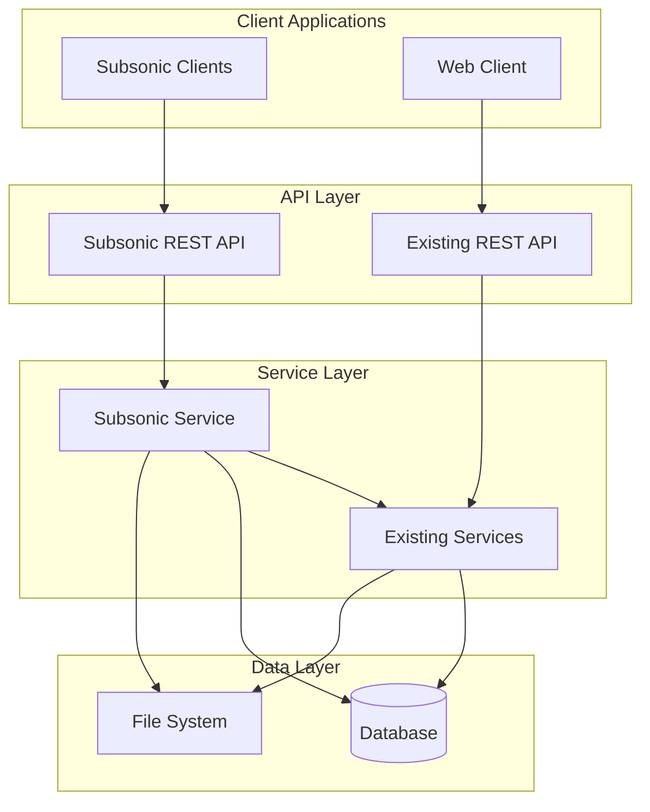

# Design Document

## Overview

The Subsonic API support will be implemented as a new API module within the existing FastAPI backend, providing full compatibility with the Subsonic REST API specification version 1.16.1. The implementation will leverage existing database models and services while adding Subsonic-specific response formatting, authentication handling, and endpoint routing. The design maintains separation of concerns by creating dedicated Subsonic controllers, services, and response models while reusing existing business logic for music library operations.

## Architecture

### High-Level Architecture



### API Integration Strategy

The Subsonic API will be integrated alongside the existing API structure:

- **Separate Router**: New `/rest/*` endpoints under a dedicated Subsonic router
- **Shared Services**: Reuse existing services for database operations and business logic
- **Format Adapters**: Transform internal data models to Subsonic response formats
- **Authentication Bridge**: Map Subsonic authentication to existing user system

## Components and Interfaces

### 1. Subsonic Router and Controllers

**Location**: `backend/app/api/routes/subsonic/`

```python
# subsonic/__init__.py
from fastapi import APIRouter
from .system import router as system_router
from .browsing import router as browsing_router
from .streaming import router as streaming_router
from .playlists import router as playlists_router
from .search import router as search_router

router = APIRouter(prefix="/rest")
router.include_router(system_router)
router.include_router(browsing_router)
router.include_router(streaming_router)
router.include_router(playlists_router)
router.include_router(search_router)
```

**Key Controllers**:
- `system.py`: ping, getLicense, getMusicFolders
- `browsing.py`: getIndexes, getArtists, getArtist, getAlbum
- `streaming.py`: stream, getCoverArt, download
- `playlists.py`: getPlaylists, getPlaylist, createPlaylist, updatePlaylist, deletePlaylist
- `search.py`: search3, search2

### 2. Subsonic Authentication Middleware

**Location**: `backend/app/core/subsonic_auth.py`

```python
class SubsonicAuthMiddleware:
    """Handles Subsonic-specific authentication methods"""
    
    def authenticate_token(self, token: str, username: str) -> User
    def authenticate_password(self, username: str, password: str, salt: str) -> User
    def validate_api_version(self, version: str) -> bool
    def generate_auth_token(self, user: User) -> str
```

**Authentication Flow**:
1. Extract authentication parameters (u, p, t, s, v, c, f)
2. Validate API version compatibility
3. Authenticate using token or password+salt method
4. Map to existing User model
5. Set authentication context for request

### 3. Subsonic Response Models

**Location**: `backend/app/schemas/subsonic/`

```python
# Base response structure
class SubsonicResponse(BaseModel):
    status: Literal["ok", "failed"]
    version: str
    type: str = "music-manager"
    serverVersion: str
    openSubsonic: bool = True

class SubsonicError(BaseModel):
    code: int
    message: str

# Specific response models
class ArtistID3(BaseModel):
    id: str
    name: str
    coverArt: Optional[str]
    albumCount: int
    starred: Optional[datetime]

class AlbumID3(BaseModel):
    id: str
    name: str
    artist: str
    artistId: str
    coverArt: Optional[str]
    songCount: int
    duration: int
    playCount: int
    created: datetime
    starred: Optional[datetime]
    year: Optional[int]
    genre: Optional[str]

class Child(BaseModel):
    id: str
    parent: str
    title: str
    album: Optional[str]
    artist: Optional[str]
    track: Optional[int]
    year: Optional[int]
    genre: Optional[str]
    coverArt: Optional[str]
    size: int
    contentType: str
    suffix: str
    duration: Optional[int]
    bitRate: Optional[int]
    path: str
    playCount: int
    discNumber: Optional[int]
    created: datetime
    albumId: Optional[str]
    artistId: Optional[str]
    type: Literal["music"]
```

### 4. Subsonic Service Layer

**Location**: `backend/app/services/subsonic_service.py`

```python
class SubsonicService:
    """Service layer for Subsonic API operations"""
    
    def __init__(self, db: Session):
        self.db = db
        self.artist_service = ArtistService(db)
        self.album_service = AlbumService(db)
        self.track_service = TrackService(db)
        self.playlist_service = PlaylistService(db)
    
    # System operations
    def get_music_folders(self) -> List[MusicFolder]
    def get_license_info(self) -> License
    
    # Browsing operations
    def get_indexes(self, music_folder_id: Optional[str]) -> Indexes
    def get_artists(self, music_folder_id: Optional[str]) -> ArtistsID3
    def get_artist(self, artist_id: str) -> ArtistWithAlbumsID3
    def get_album(self, album_id: str) -> AlbumWithSongsID3
    
    # Search operations
    def search3(self, query: str, artist_count: int, album_count: int, song_count: int) -> SearchResult3
    
    # Streaming operations
    def get_stream_info(self, track_id: str) -> StreamInfo
    def get_cover_art(self, cover_art_id: str, size: Optional[int]) -> CoverArtInfo
    
    # Data transformation methods
    def _convert_artist_to_subsonic(self, artist: Artist) -> ArtistID3
    def _convert_album_to_subsonic(self, album: Album) -> AlbumID3
    def _convert_track_to_subsonic(self, track: Track) -> Child
```

### 5. ID Mapping System

**Location**: `backend/app/services/subsonic_id_mapper.py`

```python
class SubsonicIDMapper:
    """Maps internal database IDs to Subsonic-compatible string IDs"""
    
    @staticmethod
    def encode_artist_id(internal_id: int) -> str:
        return f"ar-{internal_id}"
    
    @staticmethod
    def encode_album_id(internal_id: int) -> str:
        return f"al-{internal_id}"
    
    @staticmethod
    def encode_track_id(internal_id: int) -> str:
        return f"tr-{internal_id}"
    
    @staticmethod
    def decode_id(subsonic_id: str) -> Tuple[str, int]:
        prefix, internal_id = subsonic_id.split("-", 1)
        return prefix, int(internal_id)
    
    @staticmethod
    def get_cover_art_id(album_id: int) -> str:
        return f"al-{album_id}"
```

### 6. Response Formatter

**Location**: `backend/app/core/subsonic_formatter.py`

```python
class SubsonicResponseFormatter:
    """Formats responses in XML or JSON according to Subsonic specification"""
    
    def format_response(self, data: Any, format_type: str = "xml") -> Response:
        if format_type.lower() == "json":
            return self._format_json(data)
        return self._format_xml(data)
    
    def format_error(self, error_code: int, message: str, format_type: str = "xml") -> Response:
        error_response = {
            "subsonic-response": {
                "status": "failed",
                "version": "1.16.1",
                "type": "music-manager",
                "serverVersion": settings.version,
                "error": {"code": error_code, "message": message}
            }
        }
        return self.format_response(error_response, format_type)
    
    def _format_xml(self, data: dict) -> Response:
        # Convert to XML using xmltodict or similar
        pass
    
    def _format_json(self, data: dict) -> Response:
        # Return JSON response with proper headers
        pass
```

## Data Models

### Subsonic ID Format

- **Artists**: `ar-{internal_id}` (e.g., "ar-123")
- **Albums**: `al-{internal_id}` (e.g., "al-456")
- **Tracks**: `tr-{internal_id}` (e.g., "tr-789")
- **Playlists**: `pl-{internal_id}` (e.g., "pl-101")
- **Cover Art**: Same as album ID (e.g., "al-456")

### Music Folder Structure

```python
class MusicFolder:
    id: str = "1"  # Single music folder for simplicity
    name: str = "Music Library"
```

### Index Structure

```python
class Index:
    name: str  # Letter (A, B, C, etc.)
    artists: List[ArtistID3]

class Indexes:
    shortcut: List[ArtistID3]  # Recently added artists
    index: List[Index]  # Alphabetical grouping
    lastModified: int  # Unix timestamp
    ignoredArticles: str = "The El La Los Las Le Les"
```

## Error Handling

### Subsonic Error Codes

| Code | Description | Usage |
|------|-------------|-------|
| 0 | Generic error | Server errors, unexpected exceptions |
| 10 | Required parameter missing | Missing required query parameters |
| 20 | Incompatible Subsonic REST protocol version | Unsupported API version |
| 30 | Incompatible Subsonic REST protocol version | Client version too old |
| 40 | Wrong username or password | Authentication failure |
| 41 | Token authentication not supported | When token auth is disabled |
| 50 | User not authorized | Insufficient permissions |
| 60 | Trial period for server is over | License issues (not applicable) |
| 70 | Requested data not found | Missing artists, albums, tracks |

### Error Response Format

```xml
<?xml version="1.0" encoding="UTF-8"?>
<subsonic-response xmlns="http://subsonic.org/restapi" status="failed" version="1.16.1" type="music-manager" serverVersion="1.0.0">
    <error code="70" message="Track not found"/>
</subsonic-response>
```

## Testing Strategy

### Unit Tests

1. **Authentication Tests**
   - Token-based authentication
   - Password+salt authentication
   - Invalid credentials handling
   - API version validation

2. **Service Layer Tests**
   - Data transformation methods
   - ID mapping functions
   - Search functionality
   - Playlist operations

3. **Response Formatting Tests**
   - XML response generation
   - JSON response generation
   - Error response formatting
   - Content-type headers

### Integration Tests

1. **API Endpoint Tests**
   - All Subsonic endpoints with valid parameters
   - Error scenarios and edge cases
   - Authentication flow integration
   - Response format validation

2. **Client Compatibility Tests**
   - Test with actual Subsonic clients (DSub, Ultrasonic)
   - Streaming functionality
   - Playlist management
   - Search operations

### Performance Tests

1. **Large Library Tests**
   - Index generation with thousands of artists
   - Search performance with large datasets
   - Concurrent streaming requests
   - Memory usage during operations

2. **Streaming Tests**
   - Multiple concurrent streams
   - Range request handling
   - Transcoding performance (if implemented)
   - Cache effectiveness

## Implementation Phases

### Phase 1: Core Infrastructure
- Authentication middleware
- Response formatting system
- ID mapping utilities
- Basic error handling

### Phase 2: System and Browsing APIs
- System endpoints (ping, getLicense, getMusicFolders)
- Browsing endpoints (getIndexes, getArtists, getArtist, getAlbum)
- Cover art serving

### Phase 3: Streaming and Search
- Audio streaming endpoint
- Search functionality
- Range request support

### Phase 4: Playlist Management
- Playlist CRUD operations
- Playlist streaming support

### Phase 5: Advanced Features
- Scrobbling support
- Now playing tracking
- Performance optimizations
- Client compatibility testing

## Security Considerations

### Authentication Security
- Secure token generation and validation
- Password hashing with salt
- Rate limiting for authentication attempts
- Session management integration

### API Security
- Input validation for all parameters
- SQL injection prevention
- Path traversal protection for file access
- CORS configuration for web clients

### File Access Security
- Restrict file access to configured music directories
- Validate file paths and extensions
- Implement proper file permissions checking
- Prevent directory traversal attacks

## Performance Optimizations

### Database Optimizations
- Efficient queries with proper indexing
- Eager loading for related entities
- Query result caching for expensive operations
- Connection pooling optimization

### Streaming Optimizations
- HTTP range request support
- Proper caching headers
- Efficient file serving
- Memory-efficient streaming for large files

### Response Caching
- Cache frequently accessed data (indexes, artist lists)
- Implement cache invalidation strategies
- Use Redis or similar for distributed caching
- Cache cover art responses with appropriate TTL